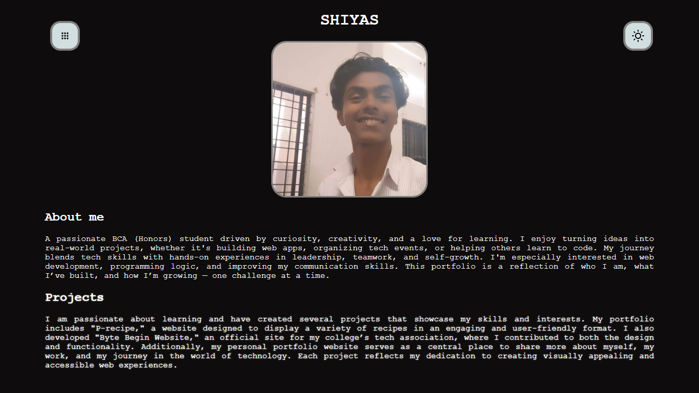
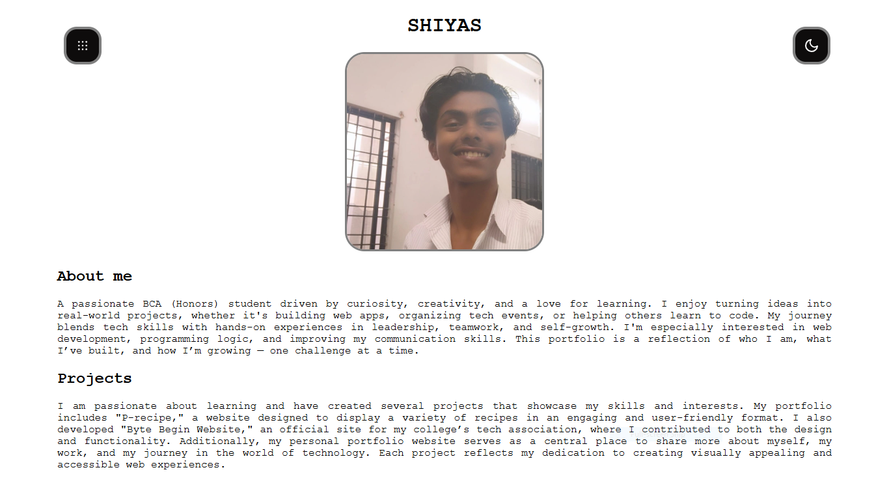

# SHIYAS PS - Portfolio

Welcome to my personal portfolio repository! This project showcases who I am, the projects I've built, and my journey in the world of technology. It is a responsive, interactive, and visually appealing website built with HTML, CSS, and JavaScript.

## 🌐 [View My Portfolio](https://shiyyaas.github.io/portfolio/)

---

## 🚀 About Me

I am a passionate BCA (Honors) student driven by curiosity, creativity, and a love for learning. I enjoy turning ideas into real-world projects, whether it's building web apps, organizing tech events, or helping others learn to code.

My journey blends tech skills with hands-on experiences in leadership, teamwork, and self-growth. I'm especially interested in web development, programming logic, and improving my communication skills. This portfolio reflects my growth—one challenge at a time.

---

## 🛠️ Features

- **Responsive Design:** Looks great on all screen sizes.
- **Theme Switcher:** Toggle between light and dark modes.
- **Smooth Navigation:** Quickly access About and Projects sections.
- **Animated UI:** Interactive elements using custom CSS and Feather Icons.

---

## 🏗️ Built With

- **HTML5**
- **CSS3** (Responsive, custom styles, hover effects, media queries)
- **JavaScript** (Theme toggling, DOM manipulation)
- **Feather Icons** (CDN for iconography)

---

## 📸 Preview Darkmode

## 📸 Preview Lightmode

---

## 📄 License

This project is licensed under the [MIT License](LICENSE).

---

## 🙌 Acknowledgements

- Thanks to everyone who supported me on my learning journey.
- Inspired by open source and the web development community.

---

## 📬 Contact

Feel free to connect with me on [GitHub](https://github.com/shiyyaas) for feedback, collaboration, or just a chat!
